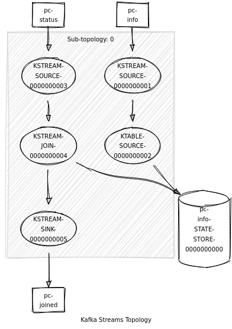

## Iniciar Kafka

    docker-compose up -d

## Abrir shell no container Kakfa

    ./exec_bash.sh

## Topico do teste simples

    kafka-topics --bootstrap-server localhost:9092 --create --partitions 2 --replication-factor 1 --topic my-topic

    kafka-topics --bootstrap-server localhost:9092 --list

## Topicos do Stream

Topics:

* pc-info - pc_id:data

    kafka-topics --bootstrap-server localhost:9092 --create --topic pc-info --partitions 2 --replication-factor 1 --config cleanup.policy=compact --config min.cleanable.dirty.ratio=0.001 --config segment.ms=1000
    
    kafka-console-producer --broker-list localhost:9092 --topic pc-info --property parse.key=true --property key.separator=:
    
    1:Shopping Barueri 1
    2:Shopping Barueri 2
    3:Shopping Iguatemi 1
    4:Shopping Iguatemi 2
    5:Tecban Alphaville
    6:Farmacia

* pc-status - pc_id:status

    kafka-topics --bootstrap-server localhost:9092 --create --topic pc-status --partitions 2 --replication-factor 1 --config cleanup.policy=compact --config min.cleanable.dirty.ratio=0.001 --config segment.ms=1000

    kafka-console-producer --broker-list localhost:9092 --topic pc-status --property parse.key=true --property key.separator=:
    
    1:on
    2:on
    3:on
    4:on
    5:on
    6:on
    1:off
    1:on
    4:off
    4:off
    4:on
    4:on
    2:off

* pc-joined - pc_id:status

    kafka-topics --bootstrap-server localhost:9092 --create --topic pc-joined --partitions 2 --replication-factor 1 --config cleanup.policy=compact --config min.cleanable.dirty.ratio=0.001 --config segment.ms=1000

    kafka-console-consumer --bootstrap-server localhost:9092 --topic pc-joined --property print.key=true --property key.separator=:

## Topologia

## Redis

    docker run --name some-redis -d redis
